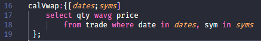

# q for Visual Studio Code

This extension adds syntaxes and provides a language server for the q language.
The language server uses tree-sitter for analyzing source codes. Tree-sitter-q is not perfect yet, so I keep it to myself.
Recommend to use theme [dracula/visual-studio-code](https://marketplace.visualstudio.com/items?itemName=dracula-theme.theme-dracula).

See the [Changelog](https://github.com/jshinonome/vscode-q/blob/master/CHANGELOG.md).

[Submit an issue](https://github.com/jshinonome/vscode-q/issues).

## q Language Server(local server, no connection to the internet)
The server will analyze q source files in all 'src' folder. Please use ';' as possible as you can, it helps Language Server to analyze source code.
- Go to Definition (F12)
- Go to Reference (Shift+F12)
- Workspace Symbol (Ctrl+T)
- Document Highlight
- Document Symbol (Ctrl+Shift+O)
- Completion (include all global namespace variables in the src folder)
- Completion Resolve

## Server Explorer
All q servers list in the q Server Explorer, and it is easy to switch to a different server.

## Query Console(default)
Output just like q console to an output channel. The console size is set to the same as q console. Use `system "c rows columns"` to change console size.
Call `kdb+/q ext: Toggle query mode` to switch Query View.

## Query View
The query view is only optimized for querying table, and the first run doesn't show table correctly. From the second run, table view should be normal.
Call `kdb+/q ext: Toggle query mode` to switch Query Console.

## Highlight Comments
Highlight `@p,@r` in comments, p stands for param, r stands for return.

## Semantic Highlight
Highlight parameters for functions. There shouldn't be any space between `{` and `[`.

## Formatter
Append space to `},],)` by formatting the file. Turn on `Editor: Format On Save` to automatically append space.

## Shortcuts
- ctrl+q: query current line
- ctrl+r: query selected line(s)

## Packages
Thanks to the following packages that makes this happen.
- [node-q](https://github.com/michaelwittig/node-q)
- [Bootstrap](https://getbootstrap.com/)
- [Tabulator](http://tabulator.info/)
- [jQuery](https://jquery.com/)
- [tree-sitter](https://github.com/tree-sitter/tree-sitter)

## Reference
I referred to the following repos when I created this extension.
- https://github.com/simongarland/vim
- https://github.com/quintanar401/language-kdb-q
- https://github.com/tree-sitter/tree-sitter-javascript
- https://github.com/bash-lsp/bash-language-server

## License
[MIT](https://github.com/jshinonome/vscode-q/blob/master/LICENSE)