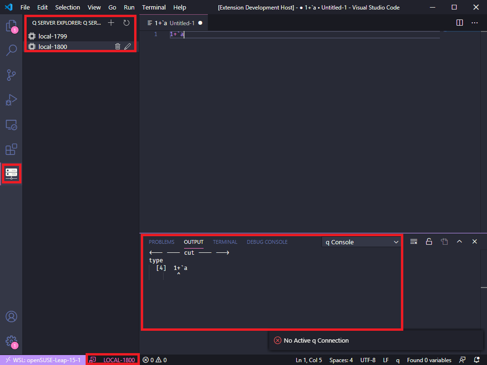
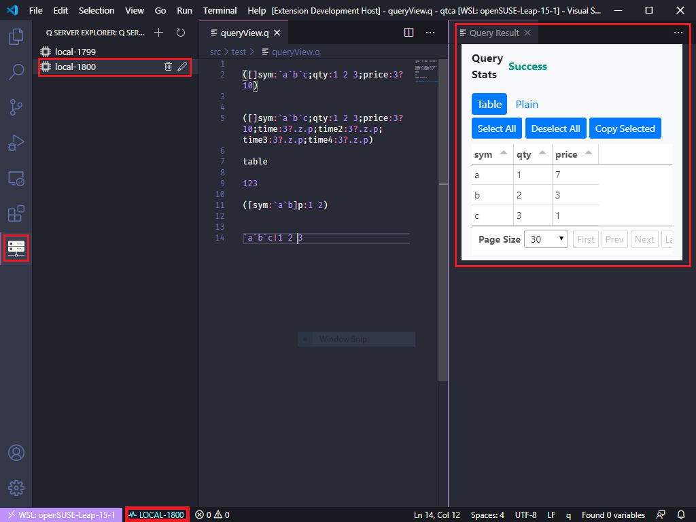
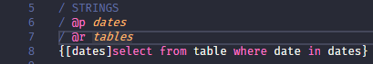

# q for Visual Studio Code

This extension adds syntaxes for the q language to VS Code.
Recommend to use theme [dracula/visual-studio-code](https://marketplace.visualstudio.com/items?itemName=dracula-theme.theme-dracula)
See the [Changelog](https://github.com/jshinonome/vscode-q/blob/master/CHANGELOG.md) to know what has changed over the last few versions of this extension.

## Server Explorer
All q servers list in the q Server Explorer, and it is easy to switch to different server.

## Query Console(default)
Output just like q console to output channel. The console size is set to the same as q console. Use `system c rows columns` to change console size.
Call `kdb+/q ext: Toggle query mode` to switch Query View.

## Query View
The query view is only optimized for querying table, and first run doesn't show table correctly. From the second run, table view should be normal. At least, you can send query to server now.
Call `kdb+/q ext: Toggle query mode` to switch Query Console.

## Highlight Comment
Highlight `@p,@r` in comments, p stands for param, r stands for return.

## Shortcuts
- ctrl+q: query current line
- ctrl+r: query selected line(s)

## Packages
Thanks to the following packages that makes this happen.
- [node-q](https://github.com/michaelwittig/node-q)
- [Bootstrap](https://getbootstrap.com/)
- [Tabulator](http://tabulator.info/)
- [jQuery](https://jquery.com/)

## Reference
I refer to the following repos for the first draft. Special thanks to [quintanar401/language-kdb-q](https://github.com/quintanar401/language-kdb-q), I had been using it for years.

- https://github.com/simongarland/vim
- https://github.com/quintanar401/language-kdb-q

## License
[MIT](https://github.com/jshinonome/vscode-q/blob/master/LICENSE)